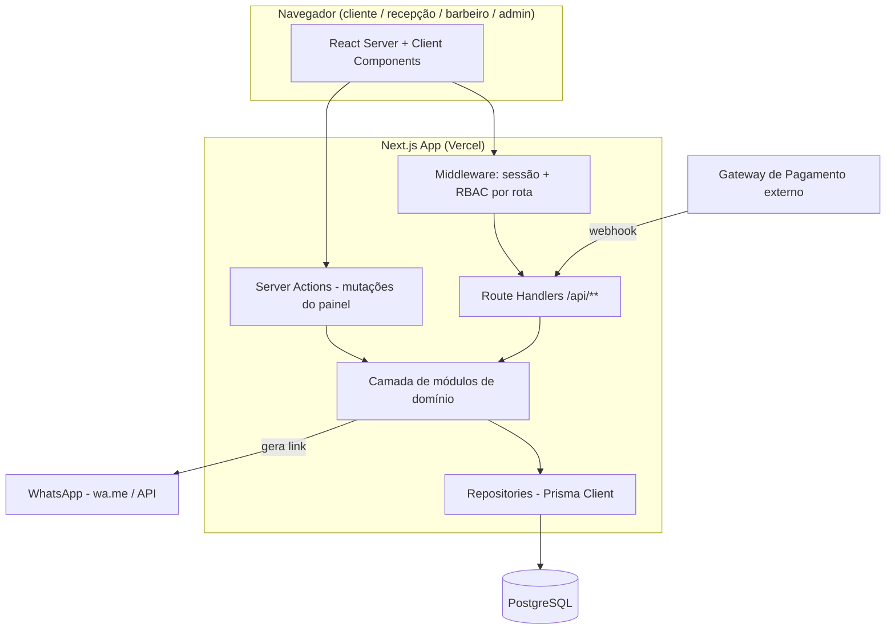
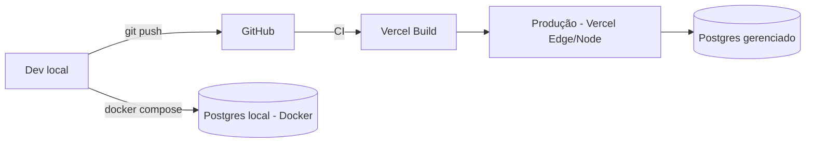

# ARQUITETURA

## 1. Visão geral

Aplicação monolítica modular em Next.js (App Router), rodando em Vercel, com PostgreSQL como única fonte de verdade. Sem microserviços, sem filas, sem cache distribuído — a carga esperada (uma barbearia, algumas dezenas de atendimentos/dia) não justifica essa complexidade (seção 52 — regra de ouro).



## 2. Camadas e responsabilidades

| Camada | Local | Responsabilidade |
|---|---|---|
| Apresentação | `app/**`, `components/**` | Páginas, formulários, layout, estado de UI |
| Orquestração HTTP | `app/api/**` (Route Handlers) | Autenticação da requisição, parsing, chamada ao módulo, resposta HTTP |
| Server Actions | `modules/*/actions.ts` | Mutações chamadas diretamente de formulários do painel admin (evita boilerplate de fetch) |
| Domínio / regras de negócio | `modules/**` | Cálculo de comissão, regras de assinatura, regras de agendamento — **toda regra de negócio mora aqui, nunca em `page.tsx` ou em Route Handler diretamente** |
| Validação | `schemas/**` (Zod) | Contratos de entrada compartilhados entre client (React Hook Form) e server (Route Handler/Server Action) |
| Acesso a dados | `repositories/**` | Único ponto que fala com o Prisma Client; módulos de domínio não importam `@prisma/client` diretamente |
| Infraestrutura transversal | `lib/**` | `db` (Prisma singleton), `auth`, `permissions`, `whatsapp`, `payments`, `logger` |

Regra de dependência: `app` → `modules` → `repositories` → `db`. Nunca o inverso. `lib` é usado por qualquer camada acima dele.

## 3. Estrutura de pastas

```
src/
  app/
    (public)/                 # site público, layout próprio
      page.tsx                # home
      login/
      cadastro/
      esqueci-senha/
    (auth)/
      perfil/
    admin/                    # protegido por middleware (RBAC)
      dashboard/
      clientes/
        [id]/
      barbeiros/
        [id]/
      servicos/
      planos/
      assinaturas/
      atendimentos/
      agendamentos/
      relatorios/
      financeiro/
      configuracoes/
    api/
      auth/[...nextauth]/
      customers/
      barbers/
      services/
      plans/
      subscriptions/
      attendances/
      appointments/
      reports/
      webhooks/payment/
  components/
    ui/                       # Design System (Button, Input, Modal, Table...)
    layout/
    dashboard/
    customers/ barbers/ services/ plans/ subscriptions/ attendances/ appointments/ reports/
  modules/
    auth/ customers/ barbers/ services/ plans/ subscriptions/
    payments/ attendances/ commissions/ appointments/ reports/ audit/ settings/
    <cada módulo>/
      service.ts              # regra de negócio
      actions.ts              # server actions (quando aplicável)
      dto.ts                  # tipos de entrada/saída do módulo
  lib/
    db/                       # prisma client singleton
    auth/                     # config Auth.js, helpers de sessão
    permissions/              # RBAC: matriz de permissões e helpers can()
    whatsapp/                 # WhatsAppService
    payments/                 # PaymentProvider (interface + adapters)
    logger/
  schemas/                    # Zod schemas por entidade
  types/                      # tipos compartilhados (não gerados pelo Prisma)
  repositories/               # 1 arquivo por entidade, só Prisma queries
prisma/
  schema.prisma
  migrations/
docs/
```

## 4. Autenticação e sessão

- Auth.js v5, `Credentials Provider`, senha com hash Argon2id.
- Sessão JWT contendo `userId`, `role`, e (quando aplicável) `customerId`/`barberId` vinculado.
- `middleware.ts` intercepta `/admin/**` e `/perfil`, redireciona não autenticados para `/login`.
- Middleware faz apenas checagem grosseira (autenticado? role mínima para entrar na área). A checagem fina de permissão (ex.: BARBEIRO só vê seus próprios atendimentos) é feita **sempre no servidor**, dentro do módulo/repository, filtrando por `barberId` da sessão — nunca confiando em parâmetro vindo do client.

## 5. RBAC

Implementado como matriz declarativa em `lib/permissions/matrix.ts`:

```ts
type Role = "ADMIN" | "GERENTE" | "RECEPCAO" | "BARBEIRO" | "CLIENTE";
type Resource = "customers" | "barbers" | "services" | "plans" | "subscriptions"
  | "attendances" | "appointments" | "reports" | "financial" | "settings" | "audit";
type Action = "create" | "read" | "update" | "delete";
```

Helper único `can(role, resource, action)` usado em todo Route Handler/Server Action antes de qualquer efeito colateral. Nunca duplicar essa lógica inline. Ver `docs/SECURITY.md` para a matriz completa e diagrama.

## 6. Pagamentos (abstração)

```ts
// lib/payments/provider.ts
interface PaymentProvider {
  createCustomer(input): Promise<ExternalCustomerId>;
  createSubscription(input): Promise<ExternalSubscription>;
  cancelSubscription(externalId): Promise<void>;
  getSubscription(externalId): Promise<ExternalSubscription>;
  handleWebhook(rawBody, signature): Promise<PaymentEvent>;
}
```

MVP (Etapa 5) implementa um `ManualPaymentProvider` (assinatura ativada manualmente pela recepção/admin — cobre barbearias que ainda cobram por Pix manual) satisfazendo a mesma interface, para não bloquear o restante do sistema em uma integração de gateway específica. Um adapter real (Stripe, Mercado Pago, etc.) pode ser plugado depois trocando apenas a implementação injetada, sem tocar em `modules/subscriptions`.

## 7. Observabilidade

Logger estruturado (`lib/logger`) em formato JSON (nível, timestamp, contexto), usado em: erros não tratados, tentativas de login, eventos de pagamento/webhook, operações de auditoria. Sem stack trace exposta ao cliente (seção 39).

## 8. Deployment



Detalhes em `docs/DEPLOYMENT.md`.
