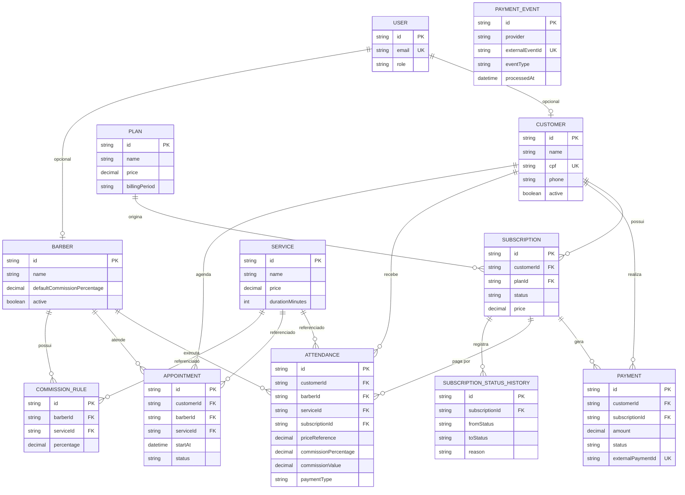
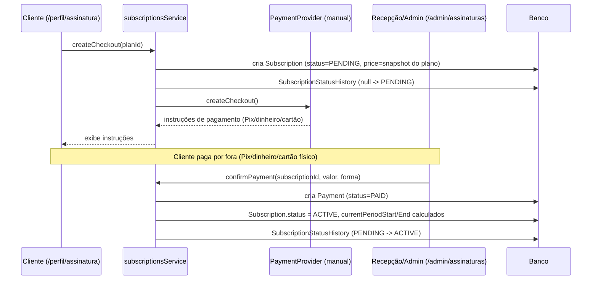
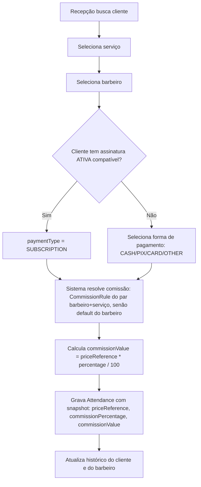
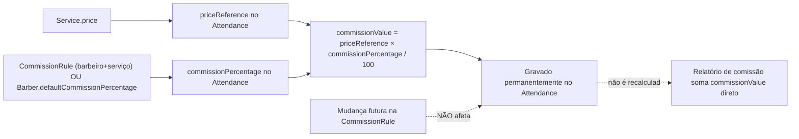
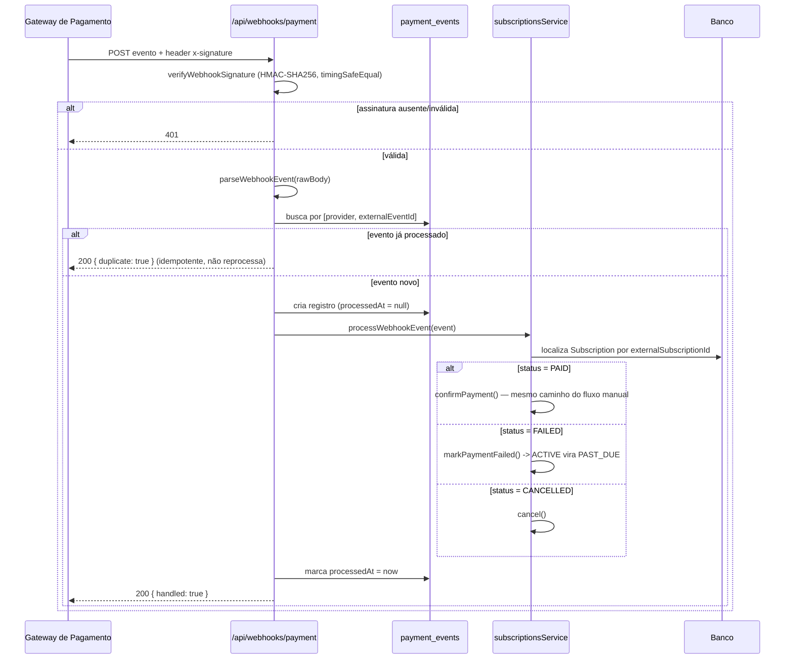
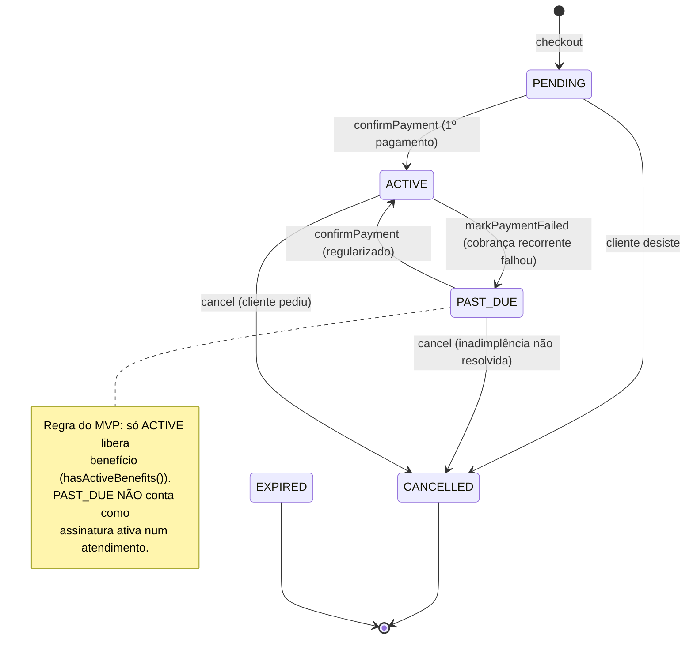
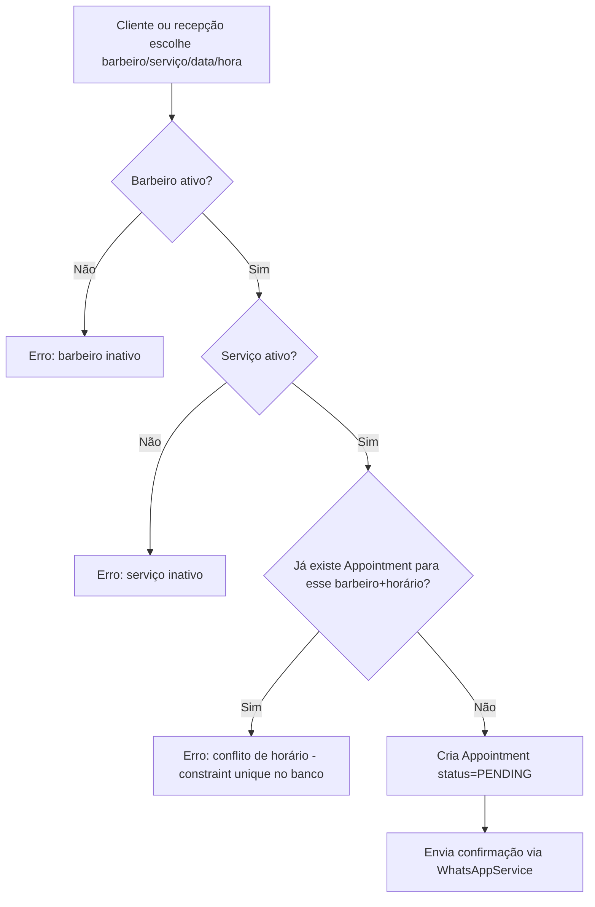
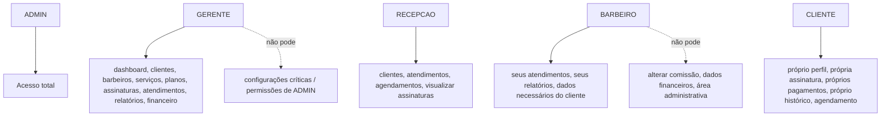

# DIAGRAMAS

## 1. Arquitetura
Ver `docs/ARCHITECTURE.md` seção 1.

## 2. ERD

## 3. Fluxo de assinatura

Implementado com o provider `manual` (ver `docs/PAYMENTS.md`) — o mesmo fluxo funciona com um
gateway real trocando apenas a implementação de `PaymentProvider` e o passo 5 (confirmação manual)
por um webhook automático.

## 4. Fluxo de atendimento

## 5. Fluxo de comissão

## 6. Fluxo de pagamento (webhook)

Testado ponta a ponta durante o desenvolvimento: assinatura ausente/inválida rejeitada com 401,
evento reenviado idêntico não duplica `Payment` (ver `docs/PAYMENTS.md`).

## 6.1 Fluxo de inadimplência

## 7. Fluxo de agendamento

## 8. RBAC

## 9. Deployment
Ver `docs/ARCHITECTURE.md` seção 8 e `docs/DEPLOYMENT.md`.
