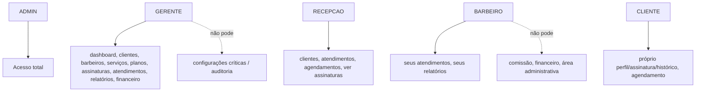

# SEGURANÇA

## Autenticação

- Auth.js v5, `Credentials Provider`, sessão JWT (`lib/auth/config.ts`).
- Senhas com hash **Argon2id** (`@node-rs/argon2`, `lib/auth/password.ts`) — nunca texto puro.
- A config usada pelo `middleware`/`proxy` (`lib/auth/auth.config.ts`) é isolada e **não importa
  Prisma nem argon2**, porque roda em Edge Runtime, que não suporta módulos nativos Node. A config
  completa com o provider Credentials (`lib/auth/config.ts`) só roda em Node.js runtime (Route
  Handlers, Server Components, Server Actions). Misturar as duas quebra o build (erro observado e
  corrigido durante o desenvolvimento: `Module not found: @node-rs/argon2-wasm32-wasi` no bundle de
  Edge Middleware).
- `trustHost: true` habilitado propositalmente para deploy self-hosted (fora da Vercel).

## RBAC

Matriz declarativa em `src/lib/permissions/matrix.ts`, papéis: `ADMIN`, `GERENTE`, `RECEPCAO`,
`BARBEIRO`, `CLIENTE`. Testada em `matrix.test.ts`.

**Duas camadas de checagem, nunca uma só:**

1. `src/proxy.ts` (middleware) — checagem grosseira: usuário autenticado? CLIENTE não entra em `/admin`.
2. `requirePermission(resource, action)` (`lib/permissions/guard.ts`) — chamada **obrigatória** como
   primeira linha de qualquer Route Handler/Server Action que tenha efeito colateral ou exponha dado
   sensível. Nunca confiar em o frontend esconder um botão/link.

## Proteção contra IDOR e escopo por linha

A matriz de permissões cobre apenas *recurso* (ex.: "attendances: create"). Escopo por *linha* —
um BARBEIRO só pode registrar/ver seus próprios atendimentos, um CLIENTE só seu próprio histórico —
é responsabilidade explícita de cada module/action, sempre comparando contra `session.user.barberId`
/`session.user.customerId`, nunca contra um `id` recebido do client. Exemplo:
`modules/attendances/actions.ts` rejeita a criação se `role === "BARBEIRO"` e o `barberId` enviado
não for o do próprio usuário.

## Validação

Todo input de mutação passa por um schema Zod (`src/schemas/*.ts`) antes de tocar o banco — nunca
confiado apenas no client. Erros de validação viram `ZodError` → mensagem amigável (nunca stack
trace) via `lib/actions/errors.ts` (Server Actions) e `lib/http/errors.ts` (Route Handlers).

## Erros e logging

- `lib/errors.ts`: `DomainError` (regra de negócio, mensagem segura para o usuário) e `NotFoundError`.
- Erros inesperados nunca viram mensagem "amigável" — sobem para o error boundary do Next, e são
  logados estruturadamente via `lib/logger` (nunca com stack trace exposta à resposta HTTP).
- Tentativas de login (sucesso/falha) são logadas com `lib/logger`.

## Auditoria

`AuditLog` (`modules/audit/service.ts`) registra: criação/atualização/desativação de clientes,
barbeiros, serviços, planos, e especificamente mudanças de comissão (`action: "COMMISSION_CHANGE"`)
com o valor novo em `metadata`. Toda action de mutação relevante chama `recordAuditLog` depois de
confirmar a permissão.

## Dinheiro

Todo valor monetário é `Decimal(10,2)` no Postgres/Prisma — nunca `Float` — evitando erros de
arredondamento em cálculo de comissão e preço.

## Webhook de pagamento

`/api/webhooks/payment` (implementado na Etapa 5, ver `docs/PAYMENTS.md`):

- Assinatura HMAC-SHA256 verificada com `timingSafeEqual` (`lib/payments/webhookSignature.ts`) antes
  de qualquer processamento — sem assinatura válida, `401` imediato.
- Idempotência via `payment_events` (`@@unique([provider, externalEventId])`): o mesmo evento
  reenviado nunca cria um `Payment` duplicado nem reprocessa a transição de status. Testado
  manualmente ponta a ponta durante o desenvolvimento (assinatura inválida → 401, evento duplicado
  → `200 { duplicate: true }` sem side-effect).
- Segredo (`PAYMENT_WEBHOOK_SECRET`) só em variável de ambiente.

## Pendências conhecidas (ver `docs/IMPLEMENTATION-PLAN.md`, Etapa 9)

- Rate limiting em `/api/auth/*`, `/api/webhooks/payment` e no checkout de assinatura ainda não implementado.
- Headers de segurança (CSP/HSTS) ainda não configurados explicitamente em `next.config.ts`.
- Auditoria formal de IDOR (cliente/barbeiro tentando acessar dado de outro) ainda não expandida em testes automatizados — a proteção existe no código (ver seção "Proteção contra IDOR" acima) mas falta cobertura de teste dedicada.
